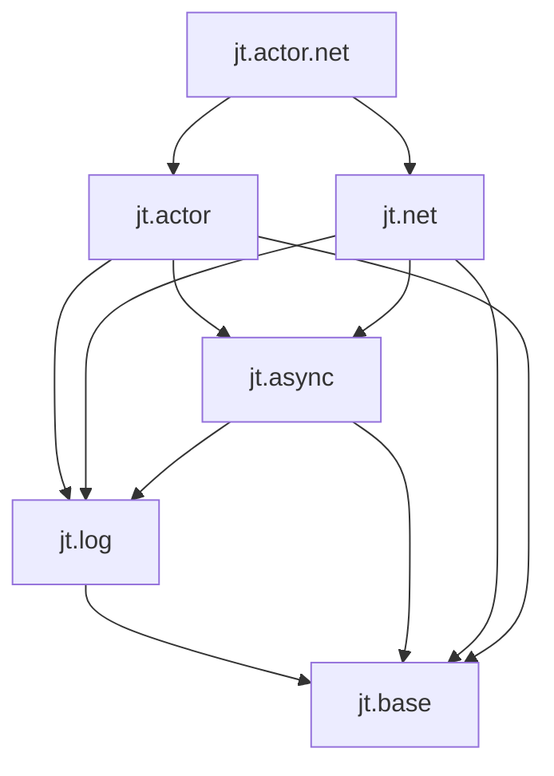

# 架构与模块边界

## 组织原则

目录按能力领域组织，命名模块按依赖边界划分。接口 `.cppm` 与非模板实现 `.cpp` 相邻；领域内部实现放入本领域的 `detail/`，跨领域共享实现放入 `src/detail/`。

一个 `libjt` 共享库承载所有已启用领域，消费别名为 `jt::jt`。各领域 CMake 文件登记源码，不按每个模块创建库。公共接口和公开模板只依赖 PUBLIC 模块；PRIVATE 模块只供实现单元和其他 PRIVATE 模块导入。

## 当前模块

| 公开入口 | 再导出/职责 |
|---|---|
| `jt` | `jt.base`、`jt.log` |
| `jt.base` | `jt.base.memory/buffer/containers/concepts` |
| `jt.base.memory` | 分配、统计 API、自定义分配器、智能指针 |
| `jt.base.buffer` | read_buffer、channel_buffer、base_memory_buffer 和常用实例 |
| `jt.base.containers` | vector、string、wstring、deque、unordered_map、unordered_multimap |
| `jt.base.concepts` | writable_buffer |
| `jt.log` | core、level、record、format、formatter、sink、sink.console、sink.file、functions |
| `jt.log.format` | 向 buffer_1k 追加格式化文本，以及本地时间缓存格式化 |
| `jt.log.core` | `:fwd`、`:logger`、`:service` 接口分区 |
| `jt.log.record` | `log_record_view`，供 formatter 和 sink 消费的只读记录视图 |

`jt::base` 承载公开基础 API，`jt::log` 承载日志 API，`jt::detail` 只包含内部基础实现。内部 `jt.detail.*` 的点号不表示模块继承；不存在公开 `jt.detail` 聚合入口。

`base_memory_buffer::append` 在扩容前识别来自自身已写入区域的来源，保存相对存储起点的偏移，并在扩容后重新定位。内部来源的完整区间须位于 `[0, write_)`；扩容保留读写位置及该区域内容。此处理不延长调用者持有的旧视图的有效期，也不改变 `channel_buffer` 的固定容量追加行为。

`read_buffer` 先限制跳过增量再推进位置，避免长度相加回绕。动态缓冲区先验证 `write_ + len` 可表示，再计算增长容量；1.5 倍增长无法表示时使用请求容量。不可表示的请求抛出 `std::length_error`，实际分配失败继续抛出 `std::bad_alloc`，两者均不提交缓冲区状态变更。

类型化分配入口将 `alignof(T)`（多态工厂为 `alignof(Derived)`）传至公开的 `allocate(size, alignment)` 重载，再通过私有桥接调用 `mi_malloc_aligned`。单参数入口使用 `alignof(std::max_align_t)`；对齐必须为非零的 2 的幂，否则抛出 `std::bad_alloc`。所有分配继续通过 `mi_usable_size` 统计并由 `mi_free` 释放，构造异常也走同一清理路径。

`jt.base.memory` 的公开定义及内存统计仍在 `memory.cpp` 模块实现中。mimalloc 调用位于普通翻译单元 `src/base/memory_backend.cpp`，该文件不导入 `std` 或 JT 模块。私有桥接头 `memory_backend.h` 不包含系统头文件，使用 `decltype(sizeof(0))` 表示大小类型；模块仅在 global module fragment 中包含该桥接头。这样将 mimalloc 3.3.2 的 `<wchar.h>` 等传递包含与 GCC 的 `std` 模块隔离，避免 macOS 系统声明的 language linkage 冲突。桥接符号不属于公开模块或 DLL API。

logger 与 service 的前向声明位于 `jt.log.core:fwd`。实现类型的非导出前向声明与使用它的接口保持同一模块归属。`formatter`、`sink` 和派生 sink 保留独立命名模块，避免回退到项目曾遇到的 GCC Darwin 重复 typeinfo 结构。

公开日志与控制台模板依赖 PUBLIC 模块 `jt.log.format`，只构造 `std::format_args`，通过非模板函数调用 `src/log/format.cpp` 中的运行时引擎。该实现单元同时负责 chrono 格式化，因为 chrono formatter 内部也会调用标准库格式化引擎。`format_local_time(timestamp, date_and_time, zone_offset)` 覆盖 128/32 字节内联缓存，按当前时区输出秒精度日期时间及 UTC 偏移。默认 formatter 的非模板成员定义位于相邻的 `detail/default_formatter.cpp`，以 `sys_seconds` 的向下取整结果作为缓存键，使用有效标志覆盖首次 epoch，并仅在格式化成功后提交缓存。毫秒部分采用同一向下取整规则，支持负时间戳。

格式化参数仅在当前调用期间借用，不进入异步队列；队列仍保存格式化后的字节。这个边界集中 JT 的标准库实例化，不能修复用户在多个翻译单元直接调用 `std::format`、chrono formatter 或在自定义 formatter 内再次使用标准库格式化引擎时的工具链问题。

队列消息 `message` 是私有实现。公开扩展接口使用 `formatter::format(const log_record_view&, ...)` 和 `sink::consume(const log_record_view&)`；视图中的 `payload` 借用消息内容，若需在调用结束后使用，应自行复制。

`dynamic_unique_ptr<Base>` 在公开内存模块中直接管理基类指针与原始分配地址，不使用标准智能指针或运行时类型查询。工厂按 Derived 的对齐分配，在构造异常时释放；私有接管构造保证两个地址匹配。移动和交换整体转移两个地址，析构及清空先置空自身，再通过虚析构销毁对象并释放原始分配地址。移动赋值先取走来源再销毁旧对象，允许来源是旧对象的所有权成员。移动、清空、交换和析构均为 noexcept，不提供裸指针接管或释放接口。

## 日志后端

- `service_impl`：logger 注册表、默认 logger 和两个 worker 的生命周期协调。
- `writer_backend`：消息分配、MPSC 队列、提交计数、写入与刷新；通过友元调用 logger 私有后台接口。
- `archive_worker`：归档队列、LZ4 上下文、压缩与过期文件清理。清理先完整匹配 `{name}_{YYYYMMDD}.log.lz4` 或 `{name}_{YYYYMMDD}_{seq}.log.lz4`：名称精确匹配，日期为八位 ASCII 数字，可选序号至少四位 ASCII 数字；空名称遵循相同规则。仅对匹配的普通文件按修改时间判断过期，不使用文件名日期计算期限，其他格式保持不动。
- 归档先排他创建 `.log.lz4.tmp`，验证并关闭输出后以硬链接原子发布 `.log.lz4`，避免检查存在性后重命名的竞争。发布后清理本次创建的临时文件；目标已存在或文件系统不支持硬链接时报告错误并保留源日志，不回退到覆盖式发布。已有临时文件保持不动。
- 文件 sink：轮转、manifest、文件写入，每日轮转以本地时间大于或等于下一日零点为边界，通过 `service::lz4_client` 提交归档请求。

内部声明使用 `jt.log.core:message/:service_impl/:writer/:archive` 非导出分区，定义使用 `module jt.log.core;`。LZ4 头文件只存在于归档内部单元；RapidJSON 只用于文件 sink 实现。

归档循环在互斥锁内等待请求或停止通知，逐条移动队首消息并弹出，再在锁外处理。消息默认构造、移动及队首弹出不分配内存，因此待处理队列耗尽可用内存时，仍能取出请求和检查停止条件。处理阶段的异常逐条隔离，失败请求的源文件保留；停止时排空已接收请求后退出。

启动时先构造 worker 状态和压缩上下文，再启动 writer，最后启动 archive。archive 线程创建失败时停止并回收 writer；worker 析构提供额外清理保证。

`service::request_stop()` 关闭异步日志提交。writer 完成正在提交的消息并排空队列，刷新仍存活的待刷新异步 logger 后通知 archive 停止，archive 排空已接收请求后退出。service 析构时通过内部 `service_impl::wait_stop()` 按 writer、archive 顺序回收线程；`wait_stop()` 不是公开 API。成员声明保证 archive 比 writer 活得更久，注册表在 worker 回收后才释放。同步日志继续保留现有直接调用 sink 的语义。

writer 用弱引用记录已消费但尚未显式刷新的 logger，显式刷新后移除记录，每次排空清理过期记录；注册表移除或替换不影响最终刷新。记录分配失败时立即刷新当前 logger，避免异常逃出工作线程。最终刷新沿用 logger 对各 sink 的异常隔离，不承诺文件系统持久化（fsync）。

logger 消息目标与归档 client 均使用弱引用。只有调用期间临时持有后端；service 销毁后异步提交和归档请求自行失效。请求停止不等于同步 logger 被禁用，也不等于持有 logger 就持有 service。

文件轮转先将候选日期和序号写入排他创建的 `manifest_{name}.json.tmp`，校验写入、刷新和关闭后，通过同目录重命名替换正式清单，再更新内存状态并提交旧日志归档。保存失败向直接 sink 调用方抛出异常，保留旧清单和源日志，后续记录可以重试；已有临时文件不会被覆盖。此原子替换不提供断电持久化（fsync）保证。

归档对本次创建的临时文件使用作用域清理，分配等异常退出也会关闭并尝试移除临时文件，使恢复后的请求能够重试；压缩过程异常还会使压缩上下文失效，后续请求重新创建上下文。文件系统本身拒绝删除时仍可能需要人工清理。

## 后续领域

以下是设计边界，不是已实现功能。当前不创建目录占位、空模块或无效构建选项。

箭头表示依赖：

- `jt.async`：协程任务、执行器、定时器、取消。不认识 Actor 服务和消息。
- `jt.net`：连接、监听、网络 I/O；使用 async，不负责业务消息分派。
- `jt.actor`：服务标识、生命周期、邮箱、消息、请求响应和服务调度；底层执行资源来自 async，不强制依赖 net。
- `jt.actor.net`：组合 Actor 与网络，将网络事件接入服务。

三个领域都依赖 log。异步执行环境、网络上下文、Actor 运行时在组件实例层面接收并持有 `std::shared_ptr<jt::log::logger>`，内部对象沿用该 logger，不引入日志全局单例。应用先启动日志，后启动其他组件；退出时停止 Actor、网络和异步环境，最后销毁日志 service，保证退出过程可记录日志。

日志继续使用独立后台线程，不反向依赖 async、net 或 actor。

实现顺序为 async → net/actor → actor.net。届时添加默认 OFF 的 `JT_ENABLE_ASYNC/NET/ACTOR`；NET、ACTOR 各自要求 ASYNC，缺失时报配置错误，ACTOR 不要求 NET。NET 与 ACTOR 同时开启时构建 actor.net。关闭 Actor 不影响通用协程和网络。Asio 在异步后端实际落地时按需引入，不直接出现在 JT 公共类型中。

## 构建边界

保留 Windows `JT_DLL_EXPORT`（BMI 固化宏）、POSIX 默认隐藏符号与公共模块初始化符号导出、MinGW stdc++exp 规则；不放宽重复定义检查。归档 worker 使用 `std::condition_variable` 配合 `std::unique_lock<std::mutex>`，避免 `condition_variable_any` 构造时隐式 `make_shared<mutex>` 产生另一份 GCC/MinGW `__tag` 强定义。消费者不得通过重新定义导入宏修改已生成 BMI。各可执行目标复制必要 Windows runtime DLL。

PUBLIC/PRIVATE 是 CMake 文件集可见性，不能仅凭 `export module` 判断是否为用户 API。模板所需依赖必须可被消费者取得；内部平台实现通过实现单元使用，不得从公共接口导入。

Windows 的库及消费目标使用容量为 1 的 Ninja 链接任务池，使链接附带的 vcpkg applocal 和 JT DLL 复制步骤不会在共享输出目录中并发写同一个文件；源码编译仍可并行。JT 合并并去重消费者与 libjt 的运行库列表，使用 `copy_if_different` 复制，避免重复写入 mimalloc 等共同依赖。

## 文件错误与保留期限

文件 sink 构造在文件系统操作之前验证 `keep_days <= 1095`，0 禁用清理，三年按每年 365 天计；直接归档清理入口也拒绝超限请求，避免时钟精度转换溢出。非法值抛出 `std::invalid_argument`。

文件流每次打开、写入、刷新和轮转关闭后检查状态。失败时关闭并清除流错误、丢弃推算大小，向直接调用方抛出 `std::ios_base::failure`；下一条记录重新打开目标并从文件系统恢复大小，再判断轮转。关闭失败不提交归档，日期边界只在轮转成功后推进。logger 维持逐 sink 异常隔离。失败记录不重放，可能留有部分内容；不承诺磁盘故障期间的完整性或 fsync 持久化。

普通 `unique_ptr` 删除器在析构对象后去除指针的 cv 限定再释放原始存储，使 `make_unique<const T>` 可用；分配对齐和多态删除器规则不变。
