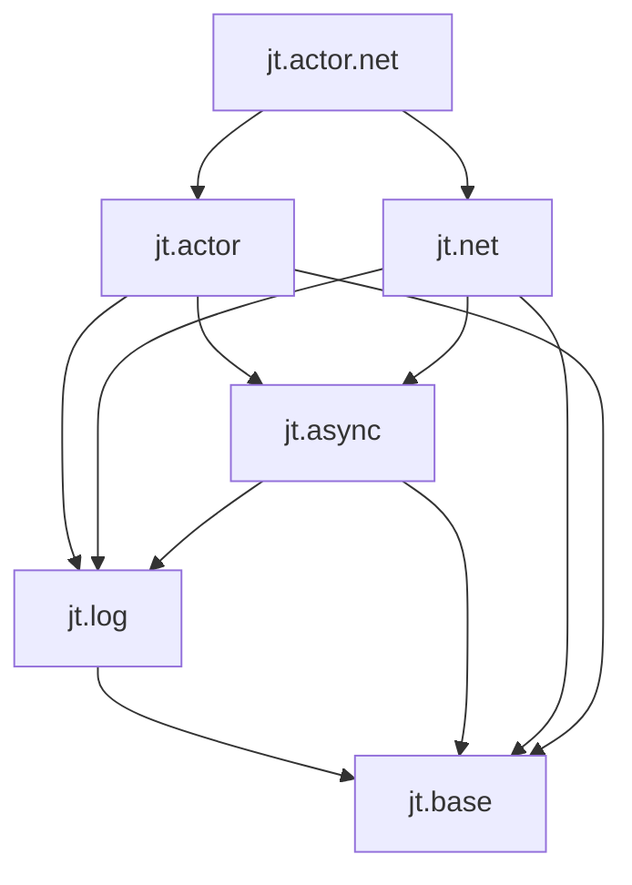

# 架构与模块边界

## 组织原则

目录按能力领域组织，命名模块按依赖边界划分。接口 `.cppm` 与非模板实现 `.cpp` 相邻；领域内部实现放入本领域的 `detail/`，跨领域共享实现放入 `src/detail/`。

一个 `libjt` 共享库承载所有已启用领域，消费别名为 `jt::jt`。各领域 CMake 文件登记源码，不按每个模块创建库。公共接口和公开模板只依赖 PUBLIC 模块；PRIVATE 模块只供实现单元和其他 PRIVATE 模块导入。

## 当前模块

| 公开入口 | 再导出/职责 |
|---|---|
| `jt` | `jt.base`、`jt.log` |
| `jt.base` | `jt.base.memory/buffer/containers/concepts` |
| `jt.base.memory` | 分配、统计 API、自定义分配器、智能指针 |
| `jt.base.buffer` | read_buffer、channel_buffer、base_memory_buffer 和常用实例 |
| `jt.base.containers` | vector、string、wstring、deque、unordered_map、unordered_multimap |
| `jt.base.concepts` | writable_buffer |
| `jt.log` | core、level、record、formatter、sink、sink.console、sink.file、functions |
| `jt.log.core` | `:fwd`、`:logger`、`:service` 接口分区 |

`jt::base` 承载公开基础 API，`jt::log` 承载日志 API，`jt::detail` 只包含内部基础实现。内部 `jt.detail.*` 的点号不表示模块继承；不存在公开 `jt.detail` 聚合入口。

logger 与 service 的前向声明位于 `jt.log.core:fwd`。实现类型的非导出前向声明与使用它的接口保持同一模块归属。`formatter`、`sink` 和派生 sink 保留独立命名模块，避免回退到项目曾遇到的 GCC Darwin 重复 typeinfo 结构。

## 日志后端

- `service_impl`：logger 注册表、默认 logger 和两个 worker 的生命周期协调。
- `writer_backend`：消息分配、MPSC 队列、提交计数、写入与刷新；通过友元调用 logger 私有后台接口。
- `archive_worker`：归档队列、LZ4 上下文、压缩与过期文件清理。
- 文件 sink：轮转、manifest、文件写入，通过 `service::lz4_client` 提交归档请求。

内部声明使用 `jt.log.core:message/:service_impl/:writer/:archive` 非导出分区，定义使用 `module jt.log.core;`。LZ4 头文件只存在于归档内部单元；RapidJSON 只用于文件 sink 实现。

启动时先构造 worker 状态和压缩上下文，再启动 writer，最后启动 archive。archive 线程创建失败时停止并回收 writer；worker 析构提供额外清理保证。

`request_stop()` 关闭日志提交。writer 完成正在提交的消息并排空队列后通知 archive 停止，archive 排空已接收请求后退出。`wait_stop()` 按 writer、archive 顺序回收线程。成员声明保证 archive 比 writer 活得更久，注册表在 worker 回收后才释放。同步日志继续保留现有直接调用 sink 的语义。

logger 消息目标与归档 client 均使用弱引用。只有调用期间临时持有后端；service 销毁后异步提交和归档请求自行失效。请求停止不等于同步 logger 被禁用，也不等于持有 logger 就持有 service。

## 后续领域

以下是设计边界，不是已实现功能。当前不创建目录占位、空模块或无效构建选项。

箭头表示依赖：

- `jt.async`：协程任务、执行器、定时器、取消。不认识 Actor 服务和消息。
- `jt.net`：连接、监听、网络 I/O；使用 async，不负责业务消息分派。
- `jt.actor`：服务标识、生命周期、邮箱、消息、请求响应和服务调度；底层执行资源来自 async，不强制依赖 net。
- `jt.actor.net`：组合 Actor 与网络，将网络事件接入服务。

三个领域都依赖 log。异步执行环境、网络上下文、Actor 运行时在组件实例层面接收并持有 `std::shared_ptr<jt::log::logger>`，内部对象沿用该 logger，不引入日志全局单例。应用先启动日志，后启动其他组件；退出时停止 Actor、网络和异步环境，最后销毁日志 service，保证退出过程可记录日志。

日志继续使用独立后台线程，不反向依赖 async、net 或 actor。

实现顺序为 async → net/actor → actor.net。届时添加默认 OFF 的 `JT_ENABLE_ASYNC/NET/ACTOR`；NET、ACTOR 各自要求 ASYNC，缺失时报配置错误，ACTOR 不要求 NET。NET 与 ACTOR 同时开启时构建 actor.net。关闭 Actor 不影响通用协程和网络。Asio 在异步后端实际落地时按需引入，不直接出现在 JT 公共类型中。

## 构建边界

保留 Windows `JT_DLL_EXPORT`（BMI 固化宏）、POSIX 默认隐藏符号与公共模块初始化符号导出、MinGW 多定义及 stdc++exp 规则。消费者不得通过重新定义导入宏修改已生成 BMI。各可执行目标复制必要 Windows runtime DLL。

PUBLIC/PRIVATE 是 CMake 文件集可见性，不能仅凭 `export module` 判断是否为用户 API。模板所需依赖必须可被消费者取得；内部平台实现通过实现单元使用，不得从公共接口导入。
